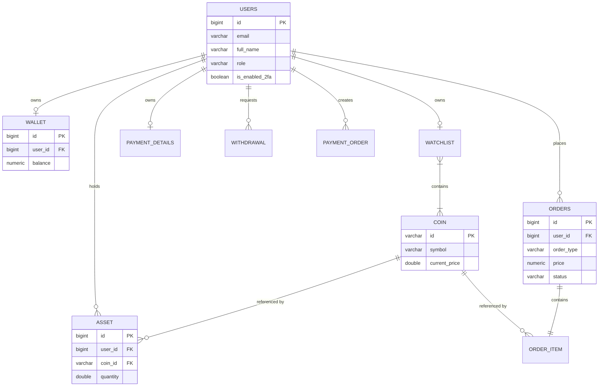

# Crypto Trading Platform

A full-stack cryptocurrency trading and asset management platform featuring live market data integration, spot trading execution, fiat wallet balance management with peer-to-peer (P2P) transfers, two-factor authentication (2FA), and administrative withdrawal processing. Built with a Spring Boot REST backend, a React Single Page Application (SPA), and PostgreSQL database storage.

---

## Table of Contents

- [Overview](#overview)
- [Features](#features)
  - [Authentication & Security](#authentication--security)
  - [Cryptocurrency Trading](#cryptocurrency-trading)
  - [Wallet](#wallet)
  - [Payments](#payments)
  - [Watchlist](#watchlist)
- [Tech Stack](#tech-stack)
- [Architecture](#architecture)
- [Project Structure](#project-structure)
- [Authentication](#authentication)
- [Trading Engine](#trading-engine)
- [Wallet & Payments](#wallet--payments)
- [Database](#database)
- [API Documentation](#api-documentation)
- [Installation](#installation)
- [Environment Variables](#environment-variables)
- [Running the Project](#running-the-project)
- [Docker Deployment](#docker-deployment)
- [Testing](#testing)
- [Known Limitations](#known-limitations)
- [Future Improvements](#future-improvements)
- [System Design](#system-design)
- [License](#license)

---

## Overview

**Crypto Trading Platform** is a full-stack financial web application designed for retail cryptocurrency traders and administrators. The application allows users to register, secure their accounts with email-based Two-Factor Authentication (2FA), track real-time market prices fetched from external CoinGecko APIs, perform spot Buy and Sell orders against their personal fiat wallet, execute P2P wallet transfers, and request fiat withdrawals for administrative approval.

### Main Use Cases
1. **Trader / Customer**: View top market cap and trending cryptocurrencies, maintain a custom coin watchlist, deposit fiat currency via payment gateways or mock gateway, buy and sell crypto assets, and transfer wallet funds to other registered users.
2. **Administrator**: Access administrative controls to review and approve or reject user fiat withdrawal requests.

---

## Features

### Authentication & Security
- **User Registration**: Register new user accounts with full name, email, and BCrypt-hashed password.
- **JWT Sign-in**: Secure stateless JWT token generation (24-hour expiration) using HMAC SHA-256 signatures.
- **Two-Factor Authentication (2FA)**: Optional 2FA via 6-digit OTP codes sent to user email upon sign-in.
- **Password Reset**: OTP-driven password recovery workflow via email verification codes.
- **Role-Based Access Control**: Strict role separation between `ROLE_CUSTOMER` and `ROLE_ADMIN`.

### Cryptocurrency Trading
- **Live Market Data**: Real-time pricing, market capitalization, ranking, volume, high/low 24h, and historical chart data sourced via CoinGecko API integration.
- **Spot Trade Execution**: Execute instant **Buy** and **Sell** orders at current market spot prices.
- **Portfolio Tracking**: Real-time asset ledger tracking owned coin quantities and average purchase prices.
- **Order History**: Comprehensive order history logging timestamps, execution prices, quantities, and order status (`SUCCESS`, `PENDING`, `CANCELLED`, `FAILED`).

### Wallet
- **Fiat Balance Ledger**: Auto-initialized fiat currency wallet for every registered user.
- **Peer-to-Peer (P2P) Transfer**: Direct wallet-to-wallet transfer of funds between registered users by receiver wallet ID.
- **Withdrawal Requests**: User-initiated fiat withdrawal requests submitted for admin review.

### Payments
- **Stripe Checkout**: Payment link creation utilizing Stripe Java SDK checkout sessions.
- **Razorpay Integration**: Payment link payload generation via Razorpay client SDK.
- **Demo Payment Gateway**: Built-in HTML mock payment gateway (`/api/payment/demo-gateway`) for local development and testing.

### Watchlist
- **Custom Watchlist**: Toggle and persist favorite cryptocurrencies to user watchlists.

---

## Tech Stack

| Layer | Technology | Version | Description |
|---|---|---|---|
| **Frontend Framework** | React | 19.2.0 | Single Page Application framework |
| **Frontend Build Tool** | Vite | 7.3.1 | Next-generation frontend tooling & bundler |
| **Frontend Router** | TanStack Router | 1.168.25 | Type-safe client-side routing |
| **State Management** | Zustand | 5.0.13 | Lightweight client state with localStorage persistence |
| **Styling & UI** | TailwindCSS v4 + Shadcn UI | 4.2.1 | Utility-first CSS & Radix UI primitives |
| **HTTP Client** | Axios | 1.16.1 | REST API client with request/response interceptors |
| **Backend Framework** | Spring Boot | 3.5.16 | Java enterprise application framework |
| **Language** | Java | 25 | Java Development Kit runtime |
| **Security Framework** | Spring Security | 3.5.16 | Stateless JWT & role-based authentication |
| **ORM / Data Access** | Spring Data JPA / Hibernate | 3.5.16 | Object-Relational Mapping framework |
| **Database** | PostgreSQL | 15-alpine | Relational Database Management System |
| **Build Tool** | Apache Maven | 3.x | Backend dependency management & build system |
| **API Documentation** | OpenAPI 3 / Swagger UI | 2.5.0 | Interactive REST API documentation |
| **Containerization** | Docker / Docker Compose | - | Multi-container environment orchestration |

---

## Architecture

The application adopts a **Client-Server / Monolithic Layered Architecture**:

```text
User / Browser (React 19 SPA)
         │
         ▼  (HTTP REST + Bearer JWT Header)
Spring Security (JwtTokenValidator Filter)
         │
         ▼
Controller Layer (com.Makushev.controller)
         │
         ▼
Service Layer (com.Makushev.service.impl)
         │
         ▼
Repository Layer (com.Makushev.repository - Spring Data JPA)
         │
         ▼
PostgreSQL Database (trading-db:5432)
```

---

## Project Structure

```text
Treading-app/
├── docker-compose.yml                      [Root / Backend Docker Compose Orchestration]
├── docs/
│   └── SYSTEM_DESIGN.md                    [Exhaustive System Design Document (HLD + LLD)]
├── Treading-app-backend/
│   ├── Dockerfile                          [Multi-stage JDK 25 Maven Container Build]
│   ├── docker-compose.yml                  [PostgreSQL + Backend Service Orchestration]
│   ├── pom.xml                             [Maven Project Dependencies Configuration]
│   ├── mvnw / mvnw.cmd                     [Maven Wrapper Executables]
│   └── src/
│       ├── main/
│       │   ├── java/com/Makushev/
│       │   │   ├── config/                 [Security, CORS, JWT & Data Initializer]
│       │   │   ├── controller/             [REST Controllers - Auth, Trade, Wallet, Coin, Admin]
│       │   │   ├── domain/                 [Enums - USER_ROLE, OrderType, OrderStatus, etc.]
│       │   │   ├── exception/              [Global Exception Handler & Error Response POJO]
│       │   │   ├── model/                  [JPA ORM Entities - User, Order, Wallet, Coin, Asset]
│       │   │   ├── repository/             [Spring Data JPA Interfaces - 13 active Repositories]
│       │   │   ├── requests/               [Validation DTOs - Signup, Login, Order, Transfer]
│       │   │   ├── response/               [Response DTOs - AuthResponse, PaymentResponse]
│       │   │   ├── service/                [Service Interfaces & Implementation Classes]
│       │   │   └── utils/                  [OTP Generation Utilities]
│       │   └── resources/
│       │       └── application.yaml        [Database, JWT, Stripe & Mail Configurations]
│       └── test/java/com/Makushev/         [Integration Test Suite]
└── Treading-app-frontend/
    ├── package.json                        [Frontend Node.js Dependencies & Scripts]
    ├── vite.config.ts                      [Vite Bundler Configuration]
    └── src/
        ├── api/                            [Axios Client & Endpoints Definition]
        ├── components/                     [UI Component Primitives & Dashboard Layouts]
        ├── routes/                         [TanStack File-Based Guarded Routes]
        └── store/                          [Zustand Persistent State Stores]
```

---

## Authentication

Authentication is implemented statelessly using JSON Web Tokens (JWT) signed via HMAC SHA-256 algorithms.

1. **Sign-up Flow**: `/auth/signup` validates user credentials, creates a BCrypt-hashed user record, initializes an empty watchlist, and returns a signed JWT.
2. **Sign-in Flow**: `/auth/signin` checks credentials against `BCryptPasswordEncoder`.
   - If **2FA is enabled**, a 6-digit OTP is generated, e-mailed via `JavaMailSender`, and a session ID is returned (`twoFactorAuth: true`). The user verifies the OTP via `/auth/two-factor/otp/{otp}` to receive the final JWT.
   - If **2FA is disabled**, the JWT is generated and returned directly.
3. **Protected Requests**: The frontend attaches `Authorization: Bearer <token>` to all HTTP requests via Axios request interceptors. `JwtTokenValidator` intercepts requests, parses authorities, and sets the Spring `SecurityContextHolder`.

---

## Trading Engine

Spot trading execution is managed transactionally by `OrderServiceImpl`:

- **Buy Order Execution (`/api/orders/pay`)**:
  1. Fetches current spot price from CoinGecko cached coin data.
  2. Calculates total cost (`price = spotPrice * quantity`).
  3. Deducts price from user's fiat wallet balance via `WalletServiceImpl`.
  4. Saves `Order` (status `SUCCESS`) and linked `OrderItem`.
  5. Adds or updates user's `Asset` holding record.
- **Sell Order Execution (`/api/orders/pay`)**:
  1. Validates that the user owns sufficient crypto asset quantity (`asset.quantity >= sellQuantity`).
  2. Calculates total sale proceeds (`price = spotPrice * quantity`).
  3. Credits proceeds to user's fiat wallet balance.
  4. Saves `Order` (status `SUCCESS`) and linked `OrderItem`.
  5. Decreases user asset holding quantity. If remaining holding value ≤ $1.00 USD, the asset record is automatically deleted.

---

## Wallet & Payments

### Wallet Operations
- **Balance Queries**: `GET /api/wallet` retrieves or creates the authenticated user's wallet.
- **Peer-to-Peer Transfer**: `PUT /api/wallet/{walletId}/transfer` transfers funds from the sender's balance to a target receiver's wallet ID.
- **Withdrawals**: Users request withdrawals via `POST /api/withdrawal/{amount}` (deducts wallet balance). Admins approve or reject via `PATCH /api/admin/withdrawal/{id}/processed/{accept}` (rejecting refunds balance).

### Payment Gateways
- **Stripe Checkout**: `POST /api/payment/STRIPE/amount/{amount}` returns a Stripe checkout session URL.
- **Razorpay Integration**: `POST /api/payment/RAZORPAY/amount/{amount}` constructs Razorpay payment link payloads.
- **Demo Gateway**: `GET /api/payment/demo-gateway` renders a built-in test payment screen. Deposits confirm via `PUT /api/wallet/deposit?order_id=X&payment_id=Y`.

---

## Database

The PostgreSQL database schema consists of **15 entities** mapped via JPA:



---

## API Documentation

When the backend application is running, full interactive OpenAPI / Swagger documentation is available at:

```text
http://localhost:8080/swagger-ui/index.html
```

### Key API Endpoints

| Category | HTTP Method | Endpoint | Description |
|---|---|---|---|
| **Auth** | POST | `/auth/signup` | Register new user account |
| **Auth** | POST | `/auth/signin` | Authenticate user credentials |
| **Auth** | POST | `/auth/two-factor/otp/{otp}` | Verify 2FA sign-in OTP |
| **User** | GET | `/api/users/profile` | Retrieve authenticated profile |
| **Coins** | GET | `/coins` | Paginated coins listing |
| **Coins** | GET | `/coins/top50` | Top 50 cryptocurrencies |
| **Orders**| POST | `/api/orders/pay` | Place spot Buy or Sell order |
| **Orders**| GET | `/api/orders` | Retrieve user order history |
| **Wallet**| GET | `/api/wallet` | Get user wallet balance |
| **Wallet**| PUT | `/api/wallet/{walletId}/transfer` | Execute P2P wallet transfer |
| **Wallet**| PUT | `/api/wallet/deposit` | Confirm fiat wallet deposit |
| **Admin** | GET | `/api/admin/withdrawal` | List pending withdrawal requests |
| **Admin** | PATCH | `/api/admin/withdrawal/{id}/processed/{accept}` | Approve/reject withdrawal request |

---

## Installation

### Prerequisites
- **Java**: JDK 25 installed and configured (`JAVA_HOME`).
- **Node.js**: Node.js v22+ and `npm` or `bun`.
- **Database**: PostgreSQL 15 running locally or via Docker.
- **Maven**: Maven 3.x (or use the embedded `./mvnw` wrapper).

---

## Environment Variables

Create environment configuration files in root `.env` or application configuration:

### Backend Configuration (`application.yaml` / `.env`)
```yaml
SERVER_PORT: 8080
DB_URL: jdbc:postgresql://localhost:5432/trading
DB_USERNAME: postgres
DB_PASSWORD: root
JWT_SECRET: your_custom_jwt_secret_key_here
STRIPE_SECRET_KEY: your_stripe_secret_key
RAZORPAY_KEY: your_razorpay_key
```

### Frontend Configuration (`Treading-app-frontend/.env`)
```env
VITE_API_BASE_URL=http://localhost:8080
```

---

## Running the Project

### 1. Start Database
Ensure PostgreSQL is running on port `5432` with database `trading`.

### 2. Start Backend Application
Navigating to `Treading-app-backend`:
```bash
cd Treading-app-backend
./mvnw spring-boot:run
```
The Spring Boot server will start on `http://localhost:8080`.

### 3. Start Frontend Application
Navigating to `Treading-app-frontend`:
```bash
cd Treading-app-frontend
npm install
npm run dev
```
The Vite development server will start on `http://localhost:5173`.

---

## Docker Deployment

To launch the full backend stack (PostgreSQL + Spring Boot app) via Docker Compose:

```bash
cd Treading-app-backend
docker-compose up --build -d
```

This starts:
- `db`: PostgreSQL 15 container listening on port `5432`.
- `app`: Spring Boot JDK 25 container listening on port `8080`.

---

## Testing

- **Backend**: Execute unit and integration tests using Maven:
  ```bash
  cd Treading-app-backend
  ./mvnw test
  ```
  *(Contains `TreadingApplicationTests.java` context loading test).*
- **Frontend**: Currently relies on manual testing and browser verification.

---

## Known Limitations

Based on codebase analysis, the following technical limitations exist in the current version:

1. **Floating Point Rounding**: Trading calculations use `double` multiplication before converting to `BigDecimal`, which may introduce minor floating-point precision artifacts.
2. **Dust Balance Deletion**: Crypto assets with an updated valuation ≤ $1.00 USD are automatically deleted during sell orders without converting fractional residual dust.
3. **Missing Database Locking**: Wallet and asset balance checks do not use pessimistic (`SELECT FOR UPDATE`) or optimistic (`@Version`) database locking, leaving potential for race conditions under heavy concurrent request volume.
4. **Non-Transactional P2P Transfer**: `walletToWalletTransfer` in `WalletServiceImpl` updates sender and receiver balances in separate steps without a `@Transactional` boundary wrapper.
5. **Unused Transaction Model**: `WalletTransaction` entity exists in the codebase but lacks an active repository interface and is not saved during wallet transactions.

---

## Future Improvements

- **WebSockets / SSE**: Implement real-time price streaming for market charts instead of HTTP polling.
- **Distributed Caching**: Add Redis caching for CoinGecko market listings and user session data.
- **Message Queues**: Integrate RabbitMQ or Apache Kafka for asynchronous order processing and trade matching.
- **Pessimistic Locking**: Add `PESSIMISTIC_WRITE` locks on wallet and asset queries to prevent double-spending race conditions.
- **Complete Audit Logging**: Implement a dedicated `WalletTransactionRepository` to log all balance adjustments.

---

## System Design

For exhaustive High-Level and Low-Level architectural documentation, sequence diagrams, and class specifications, refer to:

👉 **[docs/SYSTEM_DESIGN.md](docs/SYSTEM_DESIGN.md)**

---

## License

This project is licensed under the MIT License - see the LICENSE file for details.
